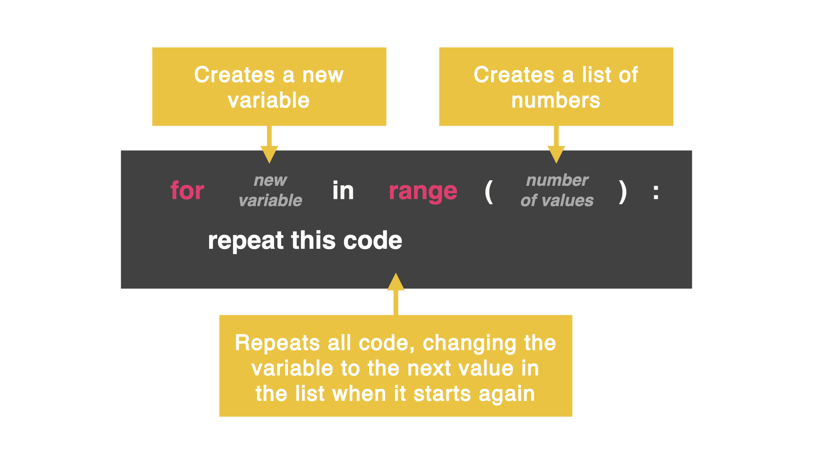
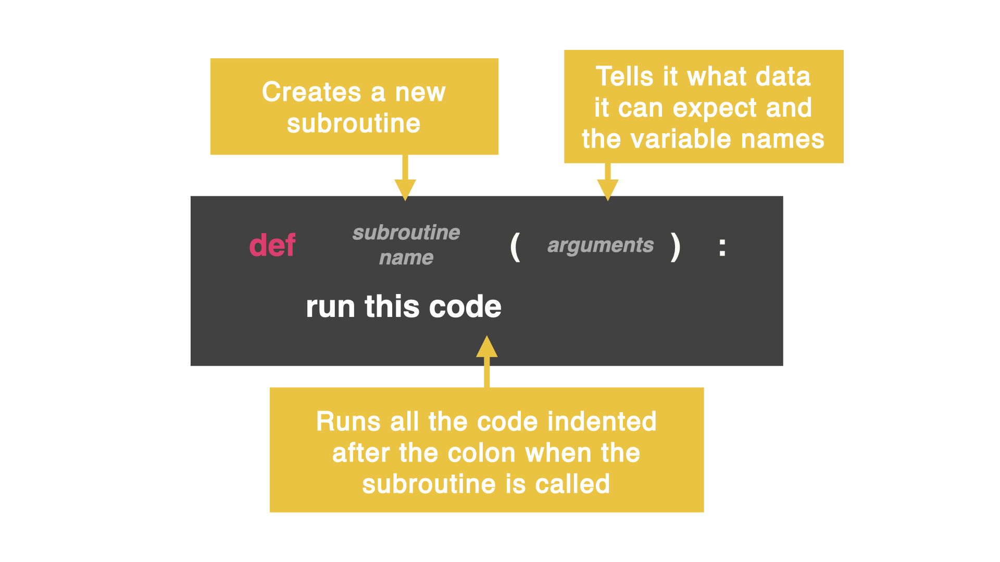
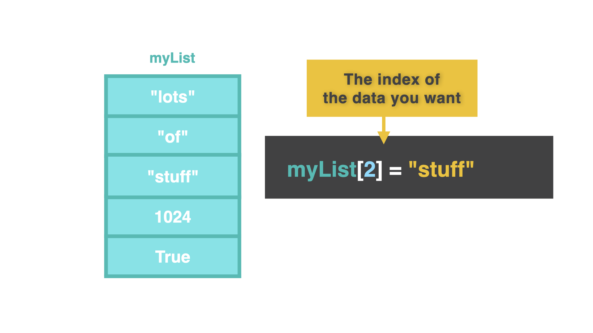
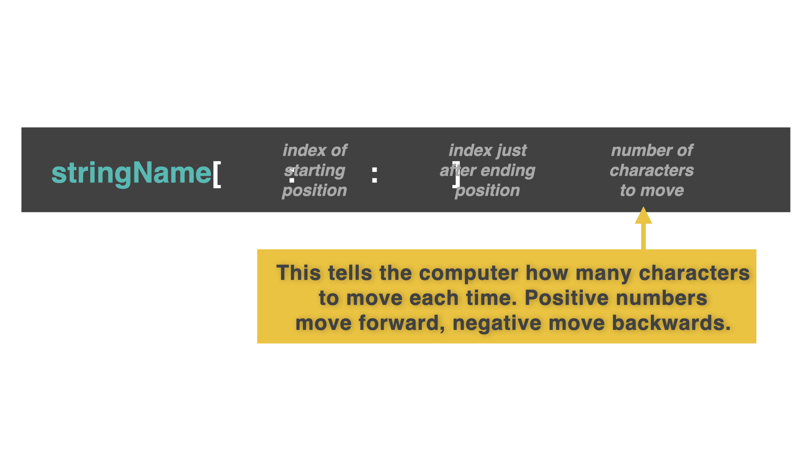

# Python

[Markdown syntax cheat sheet](https://www.markdownguide.org/cheat-sheet/)

## Print

```python
print()
print(myVar)
print("string")
print("""Structured
text""")
print("My name is", myName)
```

## Input

```python
input("")
```

## Variables

```python
myVar
```

## Colours

```python
print("\033[31m", "Warning", "\033[0m", "for being a bad, bad person.")
```

- [Colour codes](https://gist.github.com/minism/1590432)

## if

```python
myName = input("Enter your name: ")

if myName == "Jan":
    print("Welcome Jan")
else:
    print("You are not Jan")
```

```python
print("SECURE LOGIN")
username = input("Username > ")
password = input("Password> ")
if username == "mark" and password == "password":
    print("Welcome Mark!")
elif username == "suzanne" and password == "Su74nne":
    print("Hey there Suzanne!")
else:
    print("Go away!")
```

### Comparison Operators

| Operator | Name                     |
| -------- | ------------------------ |
| `==`     | equal                    |
| `!=`     | not equal                |
| `>`      | greater than             |
| `>=`     | greater than or equal to |
| `<`      | less than                |
| `<=`     | less than or equal to    |

## Numbers

```python
int whole number (ex: 42)
float any number with a decimal (ex: 1.81)
```

### round

```python
round(var, 2) #round number to the defined number of decimals
```

### Arithmetic Operators

[Python Arithmetic Operators](https://www.w3schools.com/python/gloss_python_arithmetic_operators.asp)

| Operator | Name                                                                           | Example  |
| -------- | ------------------------------------------------------------------------------ | -------- |
| +        | Addition: adds two operands                                                    | `x + y`  |
| –        | Subtraction: subtracts two operands                                            | `x – y`  |
| \*       | Multiplication: multiplies two operands                                        | `x \* y` |
| /        | Division (float): divides the first operand by the second                      | `x / y`  |
| //       | Division (floor): divides the first operand by the second                      | `x // y` |
| %        | Modulus: returns the remainder when the first operand is divided by the second | `x % y`  |
| \*\*     | Power (Exponent): Returns first raised to power second                         | `x ** y` |

# while


```python
counter = 0
while counter < 10:
    print(counter)
    counter +=1
```

Don't forget, if your condition is a `>` then you might need to `-=`. This will subtract from the variable instead of adding to it.

```python
exit = ""
while exit != "yes":
    exit = input("Do you want to exit? ")
```

# while True


After `break`, the computer jumps out of the loop to the next unindented line of code.

```python
while True:
    print("This program is running")
    goAgain = input("Go again?: ")
    if goAgain == "no":
        break

print("Aww, I was having a good time 😭")
```

The `continue` command stops executing code in the loop and starts at the top of the loop again.

```python
while True:
    print("You are in a corridor, do you go left or right?")
    direction = input("> ")
    if direction == "left":
        print("You have fallen to your death")
        break
    elif direction == "right":
        continue
    else:
        print("Ahh! You're a genius, you've won")
```

The previous code continues to loop even after the user has won. Let's fix that with the `exit()` command.

## for Loop



```python
for counter in range(10):
    print(counter)
```

```python
for i in range(100, 110):
    print(i)
```

```python
for i in range (0, 1000000, 25):
    print(i)
```

## random library

```python
import random

myNumber = random.randint(1, 10)
print(myNumber)
```

I add the lowest number (1) and the highest number (100) that can be picked.

## Subroutines



```python
def my_function():
    print("Hello from a function")
```

```python
def my_function(fname, lname):
    print(fname + " " + lname)

my_function("Emil", "Refsnes")
```

```python
def my_function(x):
    return 5 * x

print(my_function(3))
```

The `return` command sends some information back to the part of the code that called it. This means the function call is replaced with whatever was returned.

## os Library

```python
import os
os.system("clear")
```

## time Library

`time.sleep(1)` function allows us to pause the program for the amount of seconds listed

## End, Sep

```python
for i in range(0, 100):
    print(i, end="\n") #new line
```

```python
def red(text):
    print("\033[0;31m", text, "\033[0m", end="", sep="")
```

## f function

```python
print("This is {}, using {} pronouns, and is {} years old.".format(name, pronouns, age))
```

```python
print("This is {name}, using {pronouns} pronouns, and is {age} years old. Hello, {name}. How are you? Have you been having a great {age} years so far".format(name=name, pronouns=pronouns, age=age))
```

### Short variation

```python
print(f"This is {name}, using {pronouns} pronouns, and is {age} years old. Hello, {name}.")
```

```python
answer = f"You thought Day {i} was {feeling}\n"
```

## Alignment


```python
for i in range(1, 31):
    print(f"Day {i: <2} of 30")
```

## Lists



Notice we start counting the first item at 0 (instead of 1).

```python
timetable = ["Computer Science", "Math", "English", "Art", "Sport"]
print(timetable[1])
```

### Lists and Loops

```python
timetable = ["Computer Science", "Math", "English", "Art", "Watch TV"]
for lesson in timetable:
print(lesson)
```

### Append a list

You need to define blank list first:

```python
myAgenda = []
```

```python
myList.append(item)
```

### Removing items

```python
myList.remove(item)
```

### Using the Index

```python
for index in range(len(listOfEmail)):
    print(f"{index}: {listOfEmail[index]}")
```

`len` counts how many items are in a list. In this case, it is starting at 0 and then keeps going until it reaches the end of our data inside our list.

## String Manipulation

- `.lower` = all letters are lower case
- `.upper` = all letters are upper case
- `.title` = capital letter for the first letter of every word
- `.capitalize` = capital letter for the first letter of only the first word
- `.strip()` removes any spaces on either side of the word.

```python
name.lower().strip()
addItem = input("Item > ").capitalize().strip()
```

## String Slicing

```python
myString = "Hello there my friend."
print(myString[0])
print(myString[6:11])
print(myString[:11])
print(myString[12:])
```



```python
myString = "Hello there my friend."

print(myString[0:6:2])
# This code outputs 'Hlo' (every second character from 'Hello').

print(myString[::3])
# This code outputs 'Hltrmfe!' (every third character from the whole string).

print(myString[::-1])
#This code reverses the string, outputting '.dneirf ym ereht olleH'
```

### split()

```python
myString = "Hello there my friend."
print(myString.split())
#This code outputs ['Hello', 'there', 'my', 'friend.']
```
